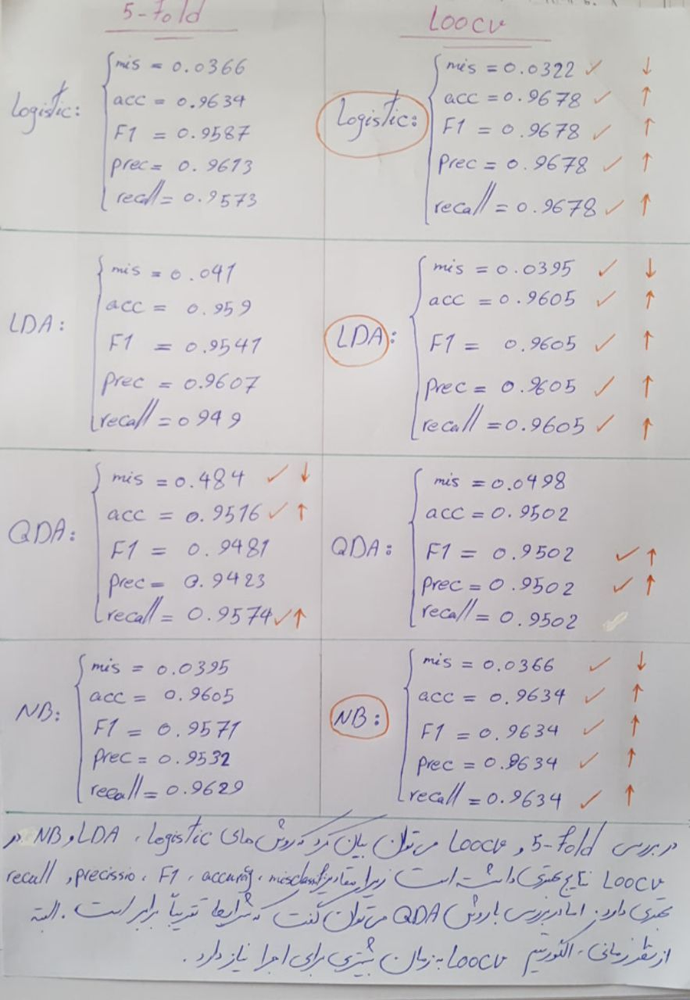

## Preparing data
In [Breast Cancer Wisconsin (Prognostic) Data Set](https://archive.ics.uci.edu/ml/datasets/Breast+Cancer+Wisconsin+%28Prognostic%29)
 Each record represents follow-up data for one breast cancer case. These are consecutive
patients seen by Dr. Wolberg since 1984, and include only those cases exhibiting
invasive breast cancer and no evidence of distant metastases at the time of diagnosis. 

These are attributes that sample-code-number is just an ID and we don't count it a feature,
and the class attribute is our output for  regression. 

       #  Attribute                     Domain
       -- -----------------------------------------
       1. Sample code number            id number
       2. Clump Thickness               1 - 10
       3. Uniformity of Cell Size       1 - 10
       4. Uniformity of Cell Shape      1 - 10
       5. Marginal Adhesion             1 - 10
       6. Single Epithelial Cell Size   1 - 10
       7. Bare Nuclei                   1 - 10
       8. Bland Chromatin               1 - 10
       9. Normal Nucleoli               1 - 10
       10. Mitoses                      1 - 10
       11. Class:                       (2 for benign, 4 for malignant)
       
First of all we need to remove the Data that have missing values (16 row).

# Analysis
We use the below models for our data and in each model we calculated the misclassification
with this function

    
    def calculate_mis_classification(y, y_pred):
        y = y.values
        misclassification_sum = 0
        for i in range(len(y)):
            misclassification_sum += 1 if y[i] != y_pred[i] else 0
        misclassificationError = misclassification_sum / len(y_pred)
        return round(misclassificationError, 4)

and finally we compare models with the misclassification of model on trained data
    

## Logistic Regression
Logistic regression is the appropriate regression analysis to conduct when the dependent variable 
is dichotomous (binary).  Like all regression analyses, the logistic regression is a predictive analysis. 
Logistic regression is used to describe data and to explain the relationship between one dependent binary
variable and one or more nominal, ordinal, interval or ratio-level independent variables.

In this model we used all of data as train data
We calculate Logistic regression on our data and the calculated result
was :
    
    MisClassification  = 0.0307
    
    Accuracy  = 0.9693
    
    F1 score  =  0.9661763977616005
    
    Precision score  =  0.9666320460768577
    
    Recall score  =  0.9657261864374835
    
    r2   =  0.8648

    mse   =  0.123
    

 
## Linear Discriminant Analysis (LDA)
Linear Discriminant Analysis (LDA) is most commonly used as dimensionality reduction technique in the pre-processing step
 for pattern-classification and machine learning applications. The goal is to project a dataset onto a lower-dimensional 
 space with good class-separability in order avoid overfitting (“curse of dimensionality”) and also reduce computational costs.
 
 the result for this model was:
 
    MisClassification  = 0.0395
    
    Accuracy  = 0.9605
    
    F1 score  =  0.9560753918820103
    
    Precision score  =  0.9615770194717563
    
    Recall score  =  0.9512420370160956
    
        
    r2   =  0.8262
    
    mse   =  0.1581

 

## Quadratic Discriminant Analysis (QDA) 
QDA is not really that much different from LDA except that you assume that the covariance matrix can be different for each class and so, 
we will estimate the covariance matrix Σk separately for each class k, k =1, 2, ... , K.

QDA allows for more flexibility for the covariance matrix, tends to fit the data better than LDA,
 but then it has more parameters to estimate. The number of parameters increases significantly with QDA. 
 Because, with QDA, you will have a separate covariance matrix for every class. If you have many classes 
 and not so many sample points, this can be a problem.
 
 
    MisClassification  = 0.041
    
    Accuracy  = 0.959
    
    F1 score  =  0.9556048731567804
    
    Precision score  =  0.9498533993036467
    
    Recall score  =  0.9626729239699952
        
        
    r2   =  0.8198
    
    mse   =  0.164
    
    

## Naive Bayes (NB)
Naive Bayes (NB) is a simple supervised function and is special form of discriminant analysis. 
It's a generative model and therefore returns probabilities.
Naive Bayes works surprisingly well even if independence assumption  is clearly violated because classification doesn’t need accurate probability estimates so long as the greatest probability is assigned to the correct class.
NB affords fast model building and scoring and can be used for both binary and multi-class classification problems.
The naive Bayes classifier is very useful in high-dimensional problems because multivariate methods like QDA and even LDA will break down. 
Naive Bayes is a stable algorithm. A small change in the the training data will not make a big change in the model.
The fundamental Naive Bayes assumption is that each attribute makes an: independent –equal

    MisClassification  = 0.0366
    
    Accuracy  = 0.9634
    
    F1 score  =  0.9603
    
    Precision score  =  0.9548
    
    Recall score  =  0.967
        
    r2   =  0.8391
    
    mse   =  0.1464

## Linear Regression
We use linear regression formula, and predict list of training X,  then because our output classes are 2 or 4 , if predicted y
was greater than 3 we assume that 4, and otherwise we assume that 2 and then with y and y-predcted calculate below scores

    MisClassification  = 0.0395
    
    Accuracy  = 0.9605
    
    F1 score  =  0.9561
    
    Precision score  =  0.9616
    
    Recall score  =  0.9512

# 5-fold
This method is a generalisation of hold-out method. Data is randomly splitted in k-folds, 
typically 10. Let’s assume 10 folds for now. Folds 2 to 10 are used for training the model,
and the residual first fold for validation of the model. Now, the process is repeated.
But this time the second fold is used for validation and folds 1, 3 to 10 are used for training the model.
This process is repeated k times.

Final predictor is the average of the models.

## Logistic Regression
    
    MisClassification  = 0.0366
    
    Accuracy  = 0.9634
    
    F1 score  =  0.9587
    
    Precision score  =  0.9613
    
    Recall score  =  0.9573
    
    r2   =  0.8527
    
    mse   =  0.1347

## Linear Discriminant Analysis (LDA)

    MisClassification  = 0.041
    
    Accuracy  = 0.959
    
    F1 score  =  0.9541
    
    Precision score  =  0.9607
    
    Recall score  =  0.949
        
    r2   =  0.8265
    
    mse   =  0.1581

## Quadratic Discriminant Analysis (QDA) 

    MisClassification  = 0.0484
    
    Accuracy  = 0.9516
    
    F1 score  =  0.9481
    
    Precision score  =  0.9423
    
    Recall score  =  0.9574
        
    r2   =  0.7692
    
    mse   =  0.2049

## Naive Bayes (NB)

    MisClassification  = 0.0395
    
    Accuracy  = 0.9605
    
    F1 score  =  0.9571
    
    Precision score  =  0.9532
    
    Recall score  =  0.9629
        
    r2   =  0.8177
    
    mse   =  0.158

# Leave one out
This method requires (n-1) data for training, 
and 1 data set for validation. This process is repeated n times. 
It is numerically very costly, but also is prone to overfitting.

## Logistic Regression

    MisClassification  = 0.0322
    
    Accuracy  = 0.9678
    
    F1 score  =  0.9678
    
    Precision score  =  0.9678
    
    Recall score  =  0.9678
        
    r2   =  0.9678
    
    mse   =  0.1288

## Linear Discriminant Analysis (LDA)

    MisClassification  = 0.0395
    
    Accuracy  = 0.9605
    
    F1 score  =  0.9605
    
    Precision score  =  0.9605
    
    Recall score  =  0.9605
        
    r2   =  0.9605
    
    mse   =  0.1581

## Quadratic Discriminant Analysis (QDA)

    MisClassification  = 0.0498
    
    Accuracy  = 0.9502
    
    F1 score  =  0.9502
    
    Precision score  =  0.9502
    
    Recall score  =  0.9502
        
    r2   =  0.9502
    
    mse   =  0.1991

## Naive Bayes (NB)

    MisClassification  = 0.0366
    
    Accuracy  = 0.9634
    
    F1 score  =  0.9634
    
    Precision score  =  0.9634
    
    Recall score  =  0.9634
    
    r2   =  0.9634
    
    mse   =  0.1464

## Conclusion
First, we examine the classification methods based on each of the parameters of the misclassification,
 accuracy, precision, and recall, and then we give a general conclusion.

### Compare based on MisClassification
In misclassification analysis if this parameter is less, the classification is better.
 Thus, with respect to the values, the logistic regression is better because it has the lowest 
 misclassification value. Other priority classification is like this:
`QDA > LDA > Naive bayes > Logistic regression`

### Compare based on Accuracy

In accuracy analysis if this parameter is greater, the classification is better.
 By comparing the precision values in these methods, we see that the logistic regression has the highest accuracy, 
 so it is better. Other priority classification is like this:
`Logistic regression > Naive bayes > LDA > QDA`

### Compare based on Precision
In precision analysis if this parameter is greater, the classification is better. 
According to the explanation, the logistic regression that has the highest precision value is a better way.
 Other priority classification is like this:
`Logistic regression > LDA > Naive bayes > QDA`

### Compare based on Recall
In recall analysis if this parameter is greater, the classification is better. According to the explanation,
 the Naive bayes that has the highest recall value is a better way. Other priority classification is like this:
`Naive bayes > Logistic regression > QDA > LDA`

### General analysis
Given that the data is bias, we use precision and recall criteria. Based on the values obtained for these 
two methods and their comparison, it can be concluded that the Logistic regression is better for classification,
Because it has better precision and recall values and it can make a better balance. The Logistic regression is 
in the first place in terms of precision and second in terms of recall.

### 5-fold VS leave-one-out VS Without-Cross-Validation
In the 5-Fold and LOOCV checking, we can say that the methods of Logistic regression 
LDA and NB in the LOOCV have better results because the values of misclassification , 
accuracy ,  F1-score , precision and recall are better . But in a QDA method we can say that the 
conditions are approximately equal. Although the LOOCV algorithm needs more time to run.

## References
* [What is Logistic Regression?](https://www.statisticssolutions.com/what-is-logistic-regression/)
* [sklearn.linear_model.LogisticRegression](http://scikit-learn.org/stable/modules/generated/sklearn.linear_model.LogisticRegression.html)
* [Linear Discriminant Analysis ](https://sebastianraschka.com/Articles/2014_python_lda.html)
* [sklearn.discriminant_analysis.LinearDiscriminantAnalysis](http://scikit-learn.org/stable/modules/generated/sklearn.discriminant_analysis.LinearDiscriminantAnalysis.html)
* [Quadratic Discriminant Analysis (QDA)](https://onlinecourses.science.psu.edu/stat857/node/80/)
* [sklearn.discriminant_analysis.QuadraticDiscriminantAnalysis](http://scikit-learn.org/stable/modules/generated/sklearn.discriminant_analysis.QuadraticDiscriminantAnalysis.html)
* [Data Mining - Naive Bayes (NB)](https://gerardnico.com/data_mining/naive_bayes )
* [sklearn.naive_bayes.GaussianNB](http://scikit-learn.org/stable/modules/generated/sklearn.naive_bayes.GaussianNB.html)

