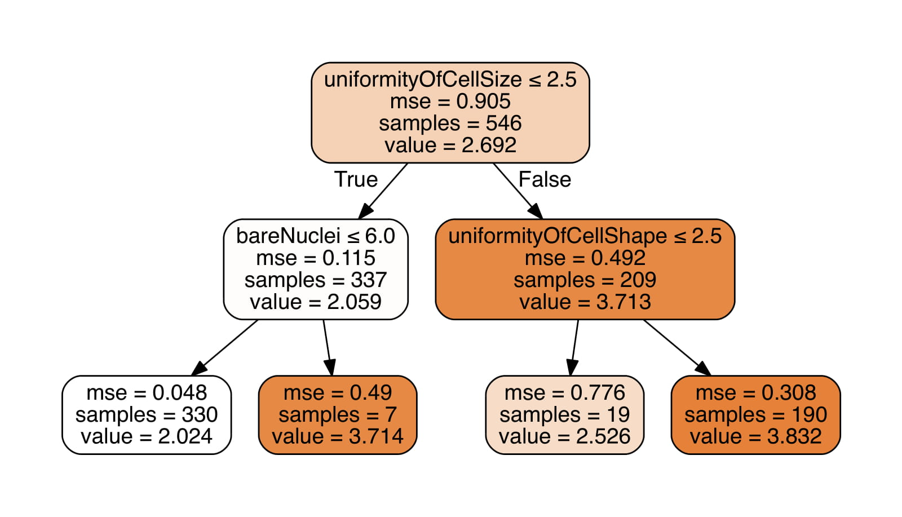
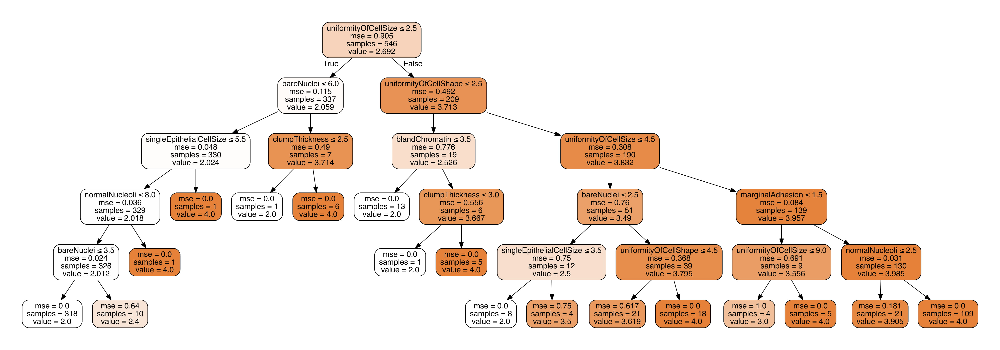

## Preparing data
In [Breast Cancer Wisconsin (Prognostic) Data Set](https://archive.ics.uci.edu/ml/datasets/Breast+Cancer+Wisconsin+%28Prognostic%29)
 Each record represents follow-up data for one breast cancer case. These are consecutive
patients seen by Dr. Wolberg since 1984, and include only those cases exhibiting
invasive breast cancer and no evidence of distant metastases at the time of diagnosis. 

These are attributes that sample-code-number is just an ID and we don't count it a feature,
and the class attribute is our output for  regression. 

       #  Attribute                     Domain
       -- -----------------------------------------
       1. Sample code number            id number
       2. Clump Thickness               1 - 10
       3. Uniformity of Cell Size       1 - 10
       4. Uniformity of Cell Shape      1 - 10
       5. Marginal Adhesion             1 - 10
       6. Single Epithelial Cell Size   1 - 10
       7. Bare Nuclei                   1 - 10
       8. Bland Chromatin               1 - 10
       9. Normal Nucleoli               1 - 10
       10. Mitoses                      1 - 10
       11. Class:                       (2 for benign, 4 for malignant)
       
First of all we need to remove the Data that have missing values (16 row).

# Analysis
## Regression Tree
    
    MSE : 0.16684800460672927
    R^2 score : 0.8200247012377183
    

## Decision Tree
A decision tree is a decision support tool that 
uses a tree-like model of decisions and their possible
consequences, including chance event outcomes, resource costs,
and utility. It is one way to display an algorithm that only
contains conditional control statements.

    MSE : 0.24077872707426434
    R^2 score : 0.7402772454909846

In the regression and decision tree, the uniformity of cellsize  is 
located at the highest point, so we can conclude that it has the most importance among the features.

# Bootstrap Aggregation(Bagging) 

Bootstrap Aggregation is a general procedure that can be used to reduce the variance for those algorithm that have high variance. An algorithm that has high variance are decision trees, like classification and regression trees (CART).

Decision trees are sensitive to the specific data on which they are trained. If the training data is changed (e.g. a tree is trained on a subset of the training data) the resulting decision tree can be quite different and in turn the predictions can be quite different.

        
    Confusion matrix : [[85  3]
     [ 2 47]]
    MSE : 0.145985401459854
    Accuracy : 0.9635036496350365
    R^2 score : 0.8425287356321839
    
# SVM
“Support Vector Machine” (SVM) is a supervised machine learning algorithm which can be used for both classification or regression challenges. However,  it is mostly used in classification problems. In this algorithm, we plot each data item as a point in n-dimensional space (where n is number of features you have) with the value of each feature being the value of a particular coordinate. Then, we perform classification by finding the hyper-plane that differentiate the two classes very well 
        
    Confusion matrix : [[83  2]
     [ 4 48]]
    MSE : 0.17518248175182483
    Accuracy : 0.9562043795620438
    R^2 score : 0.8110344827586207
    
    
# Random forrest

A problem with decision trees like CART is that they are greedy. They choose which variable to split on using a greedy algorithm that minimizes error. As such, even with Bagging, the decision trees can have a lot of structural similarities and in turn have high correlation in their predictions.

Combining predictions from multiple models in ensembles works better if the predictions from the sub-models are uncorrelated or at best weakly correlated.

Random forest changes the algorithm for the way that the sub-trees are learned so that the resulting predictions from all of the subtrees have less correlation.

    Confusion matrix : [[84  4]
     [ 3 46]]
    MSE : 0.20437956204379562
    Accuracy : 0.948905109489051
    R^2 score : 0.7795402298850574
    
    
# Conclusion

MSE :      ` Bagging  <  SVM  <  Random forest`
Accuracy :    `Bagging  >  SVM  > Random forest`

According to the obtained values, we can conclude that the Bagging method is the best method.

According to the values for the classification are better, we can conclude that the decision border is almost linear.

## Comparison with Project 1
[Project 1 results](https://gitlab.com/mranjbar.z2993/sbu-data-mining/tree/master/assignment1) 
Compare by  r2  :        `multiple linear regression  > regression tree`
Based on the obtained values , we can conclude that the multiple linear regression  method is better.

## Comparison with Project 2 
[Project 2 results](https://gitlab.com/mranjbar.z2993/sbu-data-mining/tree/master/assignment2) 

* Compare by   r2 
    `decision tree  <  QDA  < LDA  < logistic regression` 
According to the obtained values of  , we can conclude that the methods used in the second project are more efficient than the decision tree, Because the  value in the decision tree is smaller. 

* Compare by MSE   
      `decision tree  >  QDA  > LDA  > logistic regression`
According to the obtained values of  MSE, we can conclude that the methods used in the second project are more efficient than the decision tree, Because the MSE value in the decision tree is bigger.

## References

* [Bagging and Random Forest Ensemble Algorithms for Machine Learning](https://machinelearningmastery.com/bagging-and-random-forest-ensemble-algorithms-for-machine-learning/)
* [Understanding Support Vector Machine algorithm from examples (along with code)](https://www.analyticsvidhya.com/blog/2017/09/understaing-support-vector-machine-example-code/)